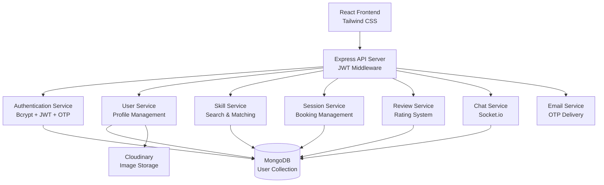

# SkillSwap Design Document

## Overview

SkillSwap is a full-stack MERN application that facilitates peer-to-peer skill exchange. The system follows a microservices-inspired architecture with clear separation between frontend (React + Tailwind) and backend (Node.js + Express + MongoDB). The application emphasizes security through JWT authentication, scalability through modular design, and user experience through responsive interfaces and real-time communication.

## Architecture

### High-Level Architecture



### Technology Stack

**Frontend:**
- React 18+ (latest stable) with functional components and hooks
- Tailwind CSS 3+ (latest) for responsive styling
- React Router 6+ (latest) for client-side routing
- Axios 1+ (latest) for API communication
- Socket.io-client 4+ (latest) for real-time chat
- React Hook Form 7+ (latest) for form management
- React Query/TanStack Query 4+ (latest) for server state management

**Backend:**
- Node.js 18+ LTS (latest LTS version)
- Express.js 4+ (latest) framework
- MongoDB 6+ (latest) with Mongoose 7+ (latest) ODM
- jsonwebtoken 9+ (latest) for JWT authentication
- bcryptjs 2+ (latest) for password hashing
- morgan 1+ (latest) for HTTP request logging
- Socket.io 4+ (latest) for real-time communication
- nodemailer 6+ (latest) for email services
- joi 17+ (latest) for input validation
- helmet 7+ (latest) for security headers
- cors 2+ (latest) for CORS handling
- express-rate-limit 6+ (latest) for rate limiting

**Development Tools:**
- Vite 4+ (latest) for frontend build tooling
- ESLint 8+ (latest) with latest React and Node.js configs
- Prettier 3+ (latest) for code formatting
- Jest 29+ (latest) for testing
- React Testing Library 13+ (latest) for component testing
- Supertest 6+ (latest) for API testing

**External Services:**
- Cloudinary SDK 1+ (latest) for image storage and optimization
- Email service provider for OTP delivery

## Components and Interfaces

### Frontend Components Structure

```
src/
├── components/
│   ├── common/
│   │   ├── Header.jsx
│   │   ├── Footer.jsx
│   │   ├── LoadingSpinner.jsx
│   │   └── ErrorBoundary.jsx
│   ├── auth/
│   │   ├── LoginForm.jsx
│   │   ├── RegisterForm.jsx
│   │   └── OTPVerification.jsx
│   ├── profile/
│   │   ├── ProfileView.jsx
│   │   ├── ProfileEdit.jsx
│   │   └── SkillsManager.jsx
│   ├── search/
│   │   ├── SearchBar.jsx
│   │   ├── FilterPanel.jsx
│   │   └── UserCard.jsx
│   ├── sessions/
│   │   ├── SessionBooking.jsx
│   │   ├── SessionList.jsx
│   │   └── SessionCard.jsx
│   ├── reviews/
│   │   ├── ReviewForm.jsx
│   │   └── ReviewDisplay.jsx
│   ├── chat/
│   │   ├── ChatWindow.jsx
│   │   ├── MessageList.jsx
│   │   └── MessageInput.jsx
│   └── admin/
│       ├── AdminDashboard.jsx
│       ├── UserManagement.jsx
│       └── ContentModeration.jsx
├── pages/
│   ├── Home.jsx
│   ├── Dashboard.jsx
│   ├── Profile.jsx
│   ├── Search.jsx
│   └── Admin.jsx
├── hooks/
│   ├── useAuth.js
│   ├── useSocket.js
│   └── useApi.js
├── context/
│   ├── AuthContext.js
│   └── SocketContext.js
└── utils/
    ├── api.js
    ├── validation.js
    └── constants.js
```

### Backend API Structure

```
src/
├── controllers/
│   ├── authController.js
│   ├── userController.js
│   ├── skillController.js
│   ├── sessionController.js
│   ├── reviewController.js
│   └── adminController.js
├── models/
│   ├── User.js
│   ├── Skill.js
│   ├── Session.js
│   ├── Review.js
│   └── Chat.js
├── routes/
│   ├── auth.js
│   ├── users.js
│   ├── skills.js
│   ├── sessions.js
│   ├── reviews.js
│   └── admin.js
├── middleware/
│   ├── auth.js
│   ├── roleCheck.js
│   ├── validation.js
│   └── errorHandler.js
├── services/
│   ├── emailService.js
│   ├── cloudinaryService.js
│   ├── otpService.js
│   └── socketService.js
└── utils/
    ├── database.js
    ├── logger.js
    └── constants.js
```

### API Endpoints

**Authentication Routes:**
- `POST /api/auth/register` - User registration
- `POST /api/auth/verify-otp` - Email verification
- `POST /api/auth/login` - User login
- `POST /api/auth/logout` - User logout
- `POST /api/auth/resend-otp` - Resend verification code

**User Routes:**
- `GET /api/users/profile` - Get user profile
- `PUT /api/users/profile` - Update user profile
- `POST /api/users/upload-avatar` - Upload profile image
- `GET /api/users/search` - Search users by skills

**Session Routes:**
- `POST /api/sessions/book` - Book a session
- `PUT /api/sessions/:id/respond` - Accept/reject session
- `GET /api/sessions/my-sessions` - Get user's sessions
- `PUT /api/sessions/:id/complete` - Mark session as completed

**Review Routes:**
- `POST /api/reviews` - Submit review
- `GET /api/reviews/user/:id` - Get user reviews
- `PUT /api/reviews/:id` - Update review

**Admin Routes:**
- `GET /api/admin/users` - Get all users
- `PUT /api/admin/users/:id/status` - Update user status
- `GET /api/admin/reports` - Get platform analytics

## Data Models

### User Model
```javascript
{
  _id: ObjectId,
  email: String (unique, required),
  password: String (hashed, required),
  firstName: String (required),
  lastName: String (required),
  bio: String,
  avatar: String (Cloudinary URL),
  role: String (enum: ['user', 'admin'], default: 'user'),
  isVerified: Boolean (default: false),
  otp: {
    code: String,
    expiresAt: Date
  },
  skillsOffered: [String],
  skillsWanted: [String],
  location: String,
  availability: [{
    day: String,
    startTime: String,
    endTime: String
  }],
  rating: {
    average: Number (default: 0),
    count: Number (default: 0)
  },
  isActive: Boolean (default: true),
  createdAt: Date,
  updatedAt: Date
}
```

### Session Model
```javascript
{
  _id: ObjectId,
  requester: ObjectId (ref: 'User'),
  provider: ObjectId (ref: 'User'),
  skill: String (required),
  description: String,
  scheduledDate: Date (required),
  duration: Number (minutes),
  status: String (enum: ['pending', 'accepted', 'rejected', 'completed', 'cancelled']),
  location: String,
  notes: String,
  rejectionReason: String,
  createdAt: Date,
  updatedAt: Date
}
```

### Review Model
```javascript
{
  _id: ObjectId,
  session: ObjectId (ref: 'Session'),
  reviewer: ObjectId (ref: 'User'),
  reviewee: ObjectId (ref: 'User'),
  rating: Number (1-5, required),
  comment: String,
  isVisible: Boolean (default: true),
  createdAt: Date,
  updatedAt: Date
}
```

### Chat Model
```javascript
{
  _id: ObjectId,
  participants: [ObjectId] (ref: 'User'),
  messages: [{
    sender: ObjectId (ref: 'User'),
    content: String,
    timestamp: Date,
    isRead: Boolean (default: false)
  }],
  lastActivity: Date,
  createdAt: Date
}
```

## Error Handling

### Frontend Error Handling
- Global error boundary to catch React component errors
- API error interceptors with user-friendly messages
- Form validation with real-time feedback
- Network error handling with retry mechanisms
- Loading states and error states for all async operations

### Backend Error Handling
- Centralized error handling middleware
- Custom error classes for different error types
- Input validation using Joi or express-validator
- Database error handling with appropriate HTTP status codes
- Security error logging without exposing sensitive information

### Error Response Format
```javascript
{
  success: false,
  error: {
    message: "User-friendly error message",
    code: "ERROR_CODE",
    details: {} // Additional error details (development only)
  }
}
```

## Testing Strategy

### Frontend Testing
- **Unit Tests:** Jest + React Testing Library for component testing
- **Integration Tests:** Testing user flows and API integration
- **E2E Tests:** Cypress for critical user journeys
- **Visual Tests:** Storybook for component documentation and testing

### Backend Testing
- **Unit Tests:** Jest for individual functions and utilities
- **Integration Tests:** Supertest for API endpoint testing
- **Database Tests:** In-memory MongoDB for isolated testing
- **Security Tests:** Authentication and authorization testing

### Test Coverage Goals
- Minimum 80% code coverage for critical paths
- 100% coverage for authentication and security functions
- All API endpoints tested with various input scenarios
- Error handling paths thoroughly tested

## Security Considerations

### Authentication & Authorization
- JWT tokens with appropriate expiration times
- Refresh token mechanism for extended sessions
- Role-based access control middleware
- Password strength requirements and hashing with bcrypt

### Data Protection
- Input sanitization and validation
- SQL injection prevention through Mongoose
- XSS protection with proper data encoding
- CORS configuration for API access control

### API Security
- Rate limiting to prevent abuse
- Request size limits
- Secure headers (helmet.js)
- Environment variable protection for sensitive data

## Performance Optimization

### Frontend Optimization
- Code splitting with React.lazy()
- Image optimization through Cloudinary
- Caching strategies for API responses
- Debounced search inputs
- Virtual scrolling for large lists

### Backend Optimization
- Database indexing for frequently queried fields
- Connection pooling for MongoDB
- Response compression
- Caching frequently accessed data
- Pagination for large datasets

### Real-time Features
- Socket.io connection management
- Room-based chat organization
- Message queuing for offline users
- Connection state management

## Deployment Architecture

### Development Environment
- Local MongoDB instance
- Environment variables for configuration
- Hot reloading for both frontend and backend
- Separate development and production builds

### Production Considerations
- MongoDB Atlas for database hosting
- Cloudinary for image CDN
- Environment-specific configuration
- Process management with PM2
- SSL/TLS encryption
- Monitoring and logging setup